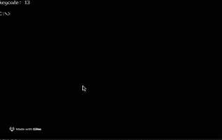

# dos-segment-clock

##### 7-Segment digital clock for DOS (BC3) 
in mode 13h (320x200 @ 256 colors) it uses no screens redraws just palette manipulation (kinda like real segment displays)
## COMPILING
I used Borland C++ 3.1 compiler for DOS, but you might use any of you choise (with some minor tuning), just target it to 16-bit DOS real mode

```
bcc sgclock.c vga.c palette.c segment.c 
```


